# EasyShop
___

### Overview
Easyshop E-commerce is an application that allows user
to show as they wish for products they want. My area of
focus for this project is directly related to the backend.

Users are able to do each of the following:
- Filter by: categories, price range, and color.
- Add products to their cart.
- Create and edit their profiles.

Admins can:

- Add or delete products.
- Add or delete categories.

# The Home Page

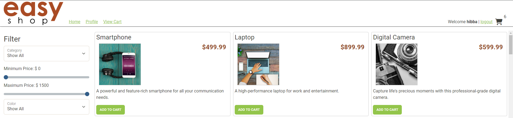

This is the first thing a user will see when entering the site.
From here they are able to filter, access their cart, and access their profile.

# Testing Both Website and Postman

**
 Categories 
**

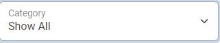

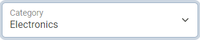

Here is a view of the filtering function on the webpage itself.

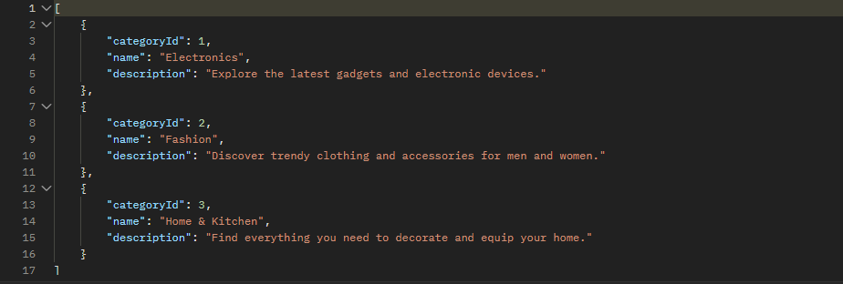

Here is a look at the adding a category on postman as well.

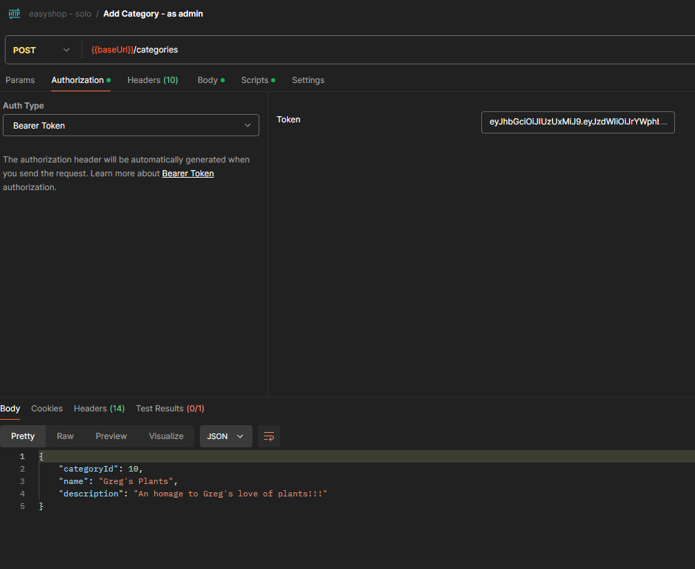

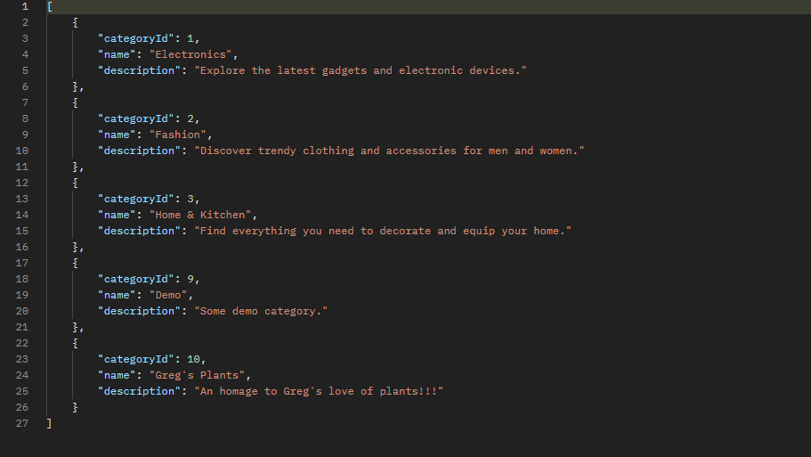

**
 Price Range 
**

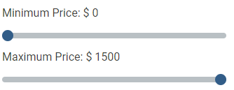

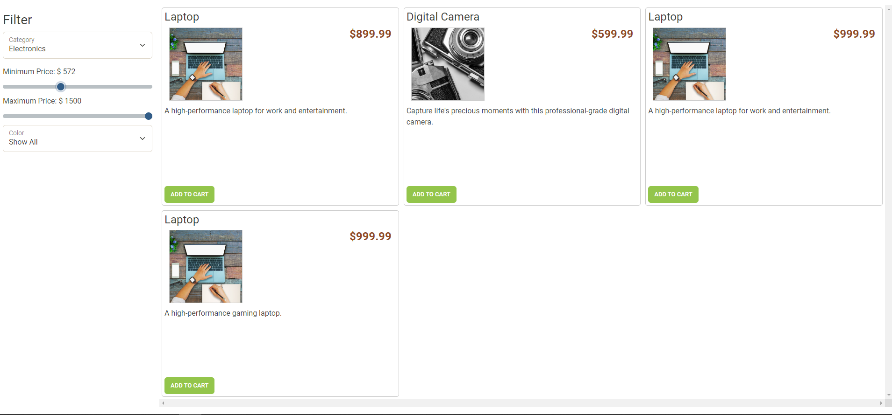

**
 Color 
**

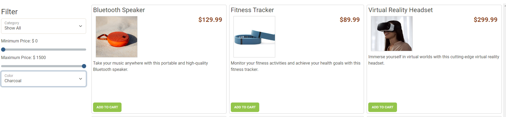

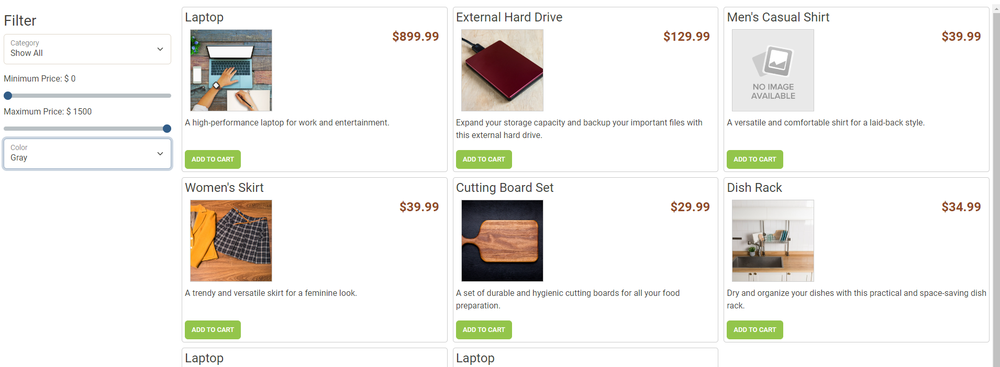

**
 Cart 
**

Cart is accessible from the moment that users login,
It also persists even upon logout.

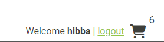

Cart will track all products and the quantity of products.

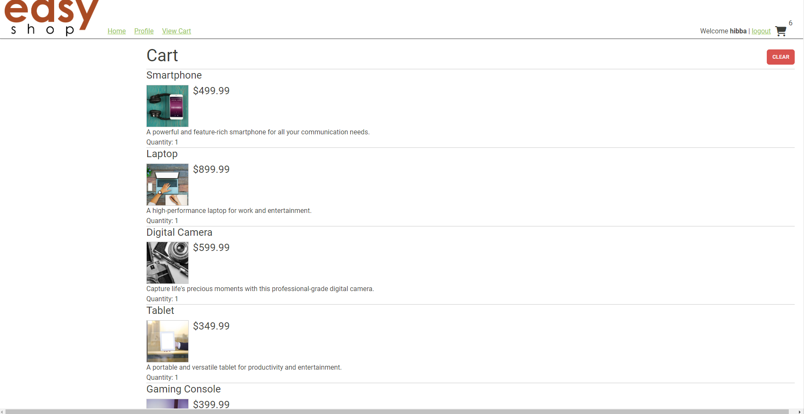

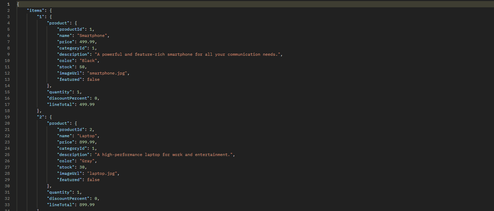

Clear clearing

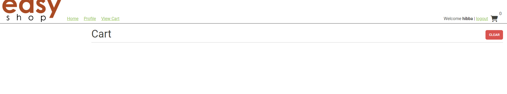

**
 Profile 
**

Users can lookup their profiles by clicking on profile.
From profile, they can then make any edits they wish within
the fields.

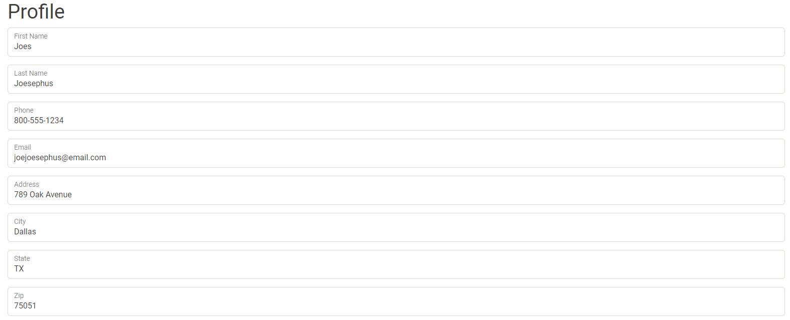

The profile from before has been fully cleared out and replaced
with just my first and last name.

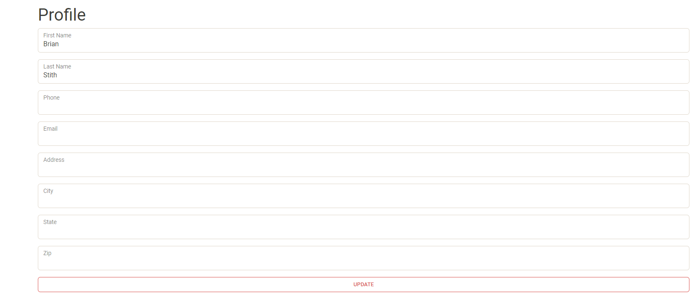

# Interesting Piece of Code

A modular way to add filtering should the website decide to implement more 
filters.

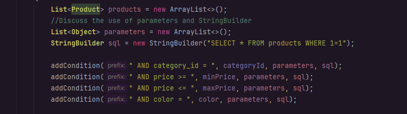

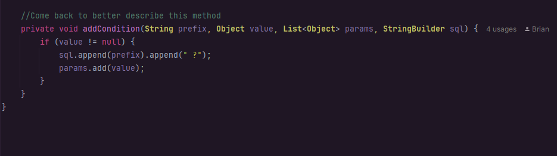